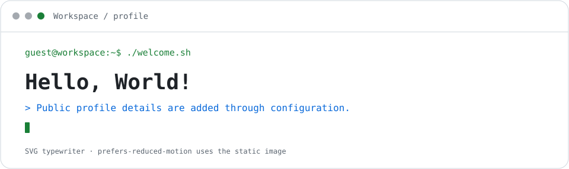
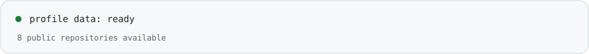
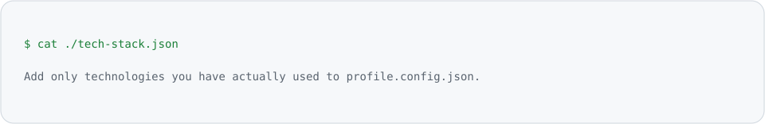
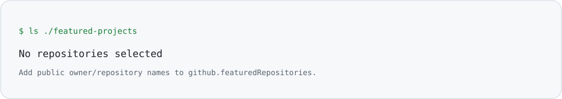
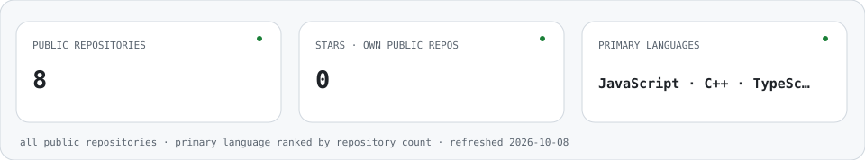
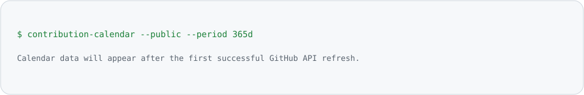

  <picture>
    <source media="(prefers-reduced-motion: reduce) and (prefers-color-scheme: dark)" srcset="assets/brand/logo-dark-static.svg" />
    <source media="(prefers-reduced-motion: reduce)" srcset="assets/brand/logo-light-static.svg" />
    <source media="(prefers-color-scheme: dark)" srcset="assets/brand/logo-dark.svg" />
    
  </picture>
   
  <!-- profile:brand:start -->
<strong>Workspace</strong>
<!-- profile:brand:end -->

<!-- profile:hero:start -->

  <picture>
    <source media="(prefers-reduced-motion: reduce) and (prefers-color-scheme: dark)" srcset="assets/generated/hero-dark-static.svg" />
    <source media="(prefers-reduced-motion: reduce)" srcset="assets/generated/hero-light-static.svg" />
    <source media="(prefers-color-scheme: dark)" srcset="assets/generated/hero-dark.svg" />
    
  </picture>

<!-- profile:hero:end -->

## About
<!-- profile:about:start -->
_Profile details are intentionally unconfigured. Add only information you want to share publicly in `profile.config.json`._

<picture>
  <source media="(prefers-reduced-motion: reduce) and (prefers-color-scheme: dark)" srcset="assets/generated/profile-status-dark-static.svg" />
  <source media="(prefers-reduced-motion: reduce)" srcset="assets/generated/profile-status-light-static.svg" />
  <source media="(prefers-color-scheme: dark)" srcset="assets/generated/profile-status-dark.svg" />
  
</picture>
<!-- profile:about:end -->

## Tech Stack
<!-- profile:stack:start -->
<picture>
  <source media="(prefers-color-scheme: dark)" srcset="assets/generated/tech-stack-dark.svg" />
  
</picture>
<!-- profile:stack:end -->

## Featured Projects
<!-- profile:projects:start -->
<picture>
  <source media="(prefers-color-scheme: dark)" srcset="assets/generated/featured-projects-dark.svg" />
  
</picture>

_Choose up to six real public repositories in `profile.config.json`._
<!-- profile:projects:end -->

## GitHub Analytics
<!-- profile:analytics:start -->
<picture>
  <source media="(prefers-reduced-motion: reduce) and (prefers-color-scheme: dark)" srcset="assets/generated/github-stats-dark-static.svg" />
  <source media="(prefers-reduced-motion: reduce)" srcset="assets/generated/github-stats-light-static.svg" />
  <source media="(prefers-color-scheme: dark)" srcset="assets/generated/github-stats-dark.svg" />
  
</picture>

<picture>
  <source media="(prefers-color-scheme: dark)" srcset="assets/generated/contribution-grid-dark.svg" />
  
</picture>

_Contribution total follows GitHub's public contribution calendar; languages are ranked by each repository's primary language._
<!-- profile:analytics:end -->

## Contribution Animation
<!-- profile:snake:start -->
<picture>
  <source media="(prefers-reduced-motion: reduce) and (prefers-color-scheme: dark)" srcset="assets/generated/contribution-grid-dark.svg" />
  <source media="(prefers-reduced-motion: reduce)" srcset="assets/generated/contribution-grid-light.svg" />
  <source media="(prefers-color-scheme: dark)" srcset="assets/generated/contribution-snake-dark.svg" />
  
</picture>

_If the animation has not been generated yet, this image shows a static setup message._
<!-- profile:snake:end -->

## Connect
<!-- profile:connect:start -->
- [GitHub repositories](https://github.com/GuangGOvO?tab=repositories)
<!-- profile:connect:end -->

---

This profile is generated from [`profile.config.json`](profile.config.json). See [`docs/DEPLOYMENT.md`](docs/DEPLOYMENT.md) to configure the profile repository and GitHub Actions.
