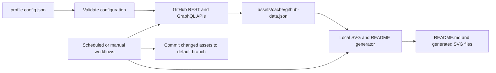

# Architecture

This repository is a small, configuration-driven profile builder. It uses Node.js built-ins for API requests, data validation, caching, and SVG generation; it has no runtime npm dependencies.

## Data flow

The README contains small generated blocks between named HTML comments. The generator updates only those blocks, leaving prose outside them available for manual editing. Keep each `profile:<name>:start` and `profile:<name>:end` marker exactly once.

## Components

- `profile.config.json` is the only source for user-written profile details, technology names, selected repositories, visual tokens, and feature switches.
- `schema/profile.config.schema.json` documents the JSON Schema contract. `scripts/lib/config.mjs` validates the same configuration shape at runtime and applies stricter URL safety checks without installing a schema package.
- `scripts/lib/github.mjs` reads public profile data. REST endpoints provide public repository metadata; GraphQL provides the contribution calendar for the requested date window.
- `assets/cache/github-data.json` stores only the public fields needed to render selected repository cards and summary images. It never stores request headers, API tokens, or raw responses.
- `assets/cache/fetch-status.json` records refresh outcome and a short, sanitized error label so the SVG can explain stale or unavailable data.
- `scripts/lib/svg.mjs` builds standalone, self-contained SVGs from fixed shapes and escaped text. It does not embed JavaScript, foreign objects, remote fonts, or remote images.
- `scripts/lib/markdown.mjs` updates the marked README blocks and uses links only for configured HTTPS URLs and validated GitHub repository names.
- `scripts/validate-assets.mjs` parses the configuration and generated SVG XML, checks README image references, rejects unsafe embedded content, and scans project sources for token-shaped strings.
- `scripts/validate-workflows.py` parses the three workflow files and checks their triggers, jobs, and pinned action references. It uses Python 3 and PyYAML.

## Workflows and write strategy

| Workflow | Work | Scheduled time (UTC) |
| --- | --- | --- |
| `update-profile.yml` | Refresh repository data, profile blocks, project cards, and status cards | 02:17 daily |
| `generate-stats.yml` | Refresh repository metrics and the static contribution calendar | 02:27 daily |
| `contribution-snake.yml` | Generate light and dark snake SVGs from the contribution calendar | 02:37 daily |

All three workflows also support `workflow_dispatch`. They share one concurrency group so generated commits do not race. They run only from scheduled or manual events, so a bot commit cannot recursively start another refresh. Each job gets only `contents: write`, which is needed to save assets. No pull request code is executed with a write token.

Generated files live on the profile repository's default branch. An `output` branch was considered but not selected: the README already refers to repository-relative assets, so a second branch would require raw-content URLs and a separate publishing path without providing a useful isolation boundary for this small profile repository.

Actions are referenced by full commit SHA. The checkout pin is `actions/checkout` v6.1.0 (`d23441a48e516b6c34aea4fa41551a30e30af803`); the snake generator pin is Platane/snk v3.5.0 (`d8f6715049803e982ee5ff501b6b9b7d5deeb09b`). Review upstream release notes and update both the SHA and this document together.

## Data definitions

- **Public repositories:** GitHub's public repository count for the configured account.
- **Stars:** Sum of star counts from the account's public owner repositories returned by the REST API. If the account has more repositories than the 2,000-repository safety cap, the card identifies the scanned subset.
- **Primary languages:** Each scanned repository contributes its GitHub API `language` value once. This is repository-count ranking, not a byte-weighted language breakdown.
- **Contributions:** GitHub's contribution-calendar total over the preceding 365 days. It can include public commits, issues, pull requests, and other qualifying activity; it is not presented as a commit-only count. The workflow does not request the `read:user` scope, so private contribution counts are not intentionally included. REST requests set the documented `2026-03-10` API version.
- **Featured repositories:** Only the explicit `github.featuredRepositories` allowlist is displayed. API descriptions and counts are treated as untrusted text and escaped before SVG output.

## Failure behavior

API requests have a 15-second timeout, bounded retries for transient connection/server errors, and explicit 403/429 rate-limit handling. A failed refresh updates only the diagnostic status; it does not replace the last successful data cache. Generators render cached data when available. The snake workflow writes output only after the generator succeeds, so a failed action leaves the checked-out prior SVG untouched and does not commit a deletion.
